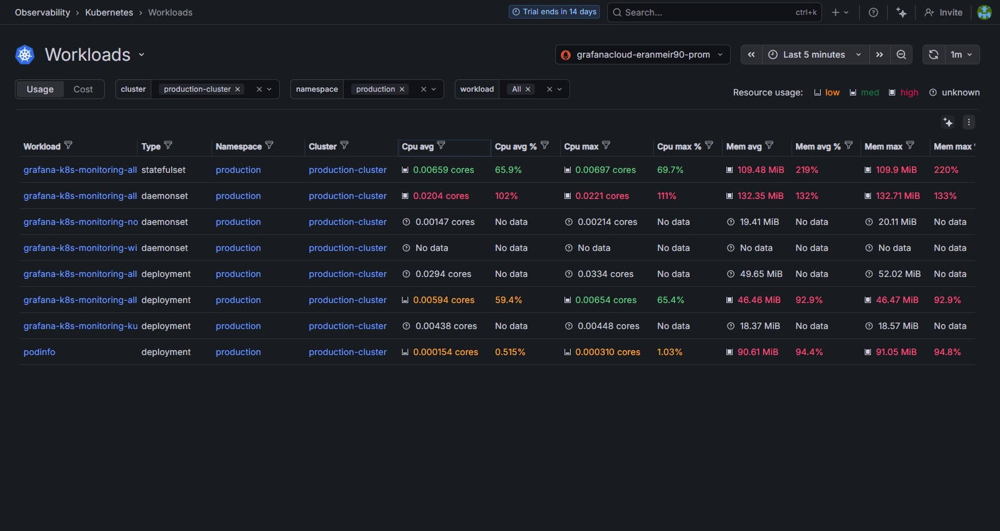
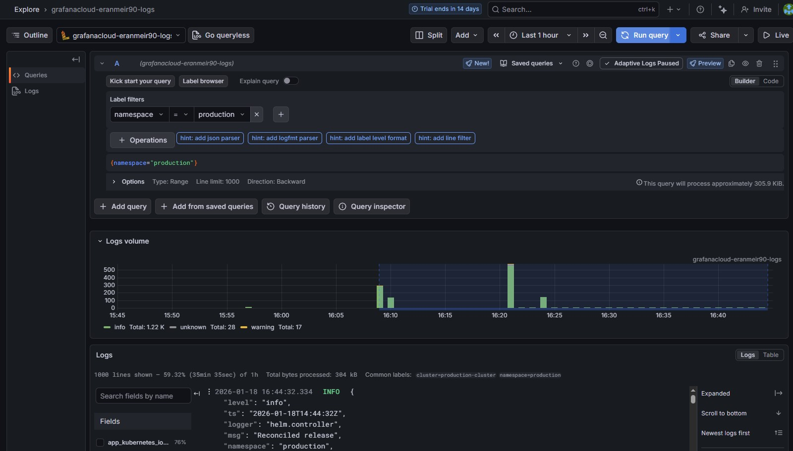

# GKE GitOps Platform with Full-Stack Observability


## ⚡ Tech Stack

The platform relies on a modern, cloud-native toolchain.


---

## 📋 Project Overview

This project represents a **production-grade Kubernetes platform** built from scratch using Infrastructure-as-Code (IaC) and GitOps principles.

The objective was to engineer a complete software delivery lifecycle, not just a simple cluster. This includes provisioning infrastructure on Google Cloud, automating application deployment via GitHub Actions, and implementing a secured, full-stack observability pipeline using the Grafana Stack (Mimir, Loki, and Alloy).

```mermaid
graph TD
    User[Developer] -->|Push Code| Repo[GitHub Repository]
    Repo -->|Trigger| Action[GitHub Actions Runner]
    
    subgraph CI_CD_Pipeline [Deploy to GKE Workflow]
        Action -->|1. Auth| GCP[Google Cloud Platform]
        Action -->|2. Apply Manifests| GKE[GKE Cluster]
        Action -->|3. Inject Secrets| Helm[Helm Upgrade]
    end
    
    subgraph Observability [Grafana Stack]
        Helm -->|Deploy| Alloy[Grafana Alloy Agent]
        Alloy -->|Push Logs| Loki[Grafana Loki]
        Alloy -->|Push Metrics| Mimir[Grafana Mimir]
    end
   ```

**Key Capabilities:**
* **Zero-Touch Provisioning:** Infrastructure created and destroyed automatically via Terraform.
* **GitOps CI/CD:** Applications are deployed immediately upon code commit using Helm.
* **End-to-End Observability:** Real-time metrics and log aggregation for rapid troubleshooting.
* **Security First:** Secrets injection and strict RBAC policies for all service accounts.

---

## 🏗️ Architecture

The platform is architected around the "Modern DevOps Stack," ensuring scalability and reproducibility.

| Component | Technology | Role in Architecture |
| :--- | :--- | :--- |
| **Cloud Provider** | **Google Cloud Platform (GCP)** | Hosting resources (VPC, Compute, IAM). |
| **Orchestrator** | **GKE Autopilot** | Managed Kubernetes environment for container orchestration. |
| **IaC** | **Terraform** | Declarative infrastructure provisioning (State managed locally). |
| **CI/CD** | **GitHub Actions** | Automated testing, Helm packaging, and deployment pipeline. |
| **Package Manager** | **Helm** | Management of complex Kubernetes manifests and charts. |
| **Observability** | **Grafana Cloud Stack** | **Alloy** (Collector), **Mimir** (Metrics), **Loki** (Logs). |
| **Microservice** | **Python** | Sample custom application (`podinfo`) deployed to test the pipeline. |

---

## 📸 Platform Observability Showcase

Evidence of the running platform, demonstrating successful deployment and monitoring.

### 1. Cluster Health & Infrastructure
*Visual proof of the underlying GKE infrastructure and node provisioning.*


> **Insight:** Real-time dashboard showing **2 active nodes** and **51 workloads** running across the cluster. The CPU/Memory graphs confirm the infrastructure is rightsized and healthy.

### 2. Workload & Deployment Verification
*Proof of the GitOps pipeline successfully deploying custom applications.*


> **Insight:** The `production` namespace view confirms the successful deployment of the **`podinfo`** application (bottom) alongside the **`grafana-k8s-monitoring`** stack. The "Running" status validates the Helm chart configuration and RBAC permissions.

### 3. Centralized Logging (Loki)
*Demonstration of the log aggregation pipeline for troubleshooting.*


> **Insight:** Live log ingestion from Grafana Loki. The query `{namespace="production"}` aggregates logs from all pods in the environment, allowing for instant filtering by pod, container, or error level without SSH-ing into nodes.

---

## 🛠️ Key Technical Challenges Solved

Building this platform required solving several complex engineering challenges:

### 🔐 1. Secret Management & Injection
**Challenge:** How to provide the Grafana Agent with API tokens without hardcoding them in the `values.yaml` file?
**Solution:**
* Implemented **GitHub Secrets Injection** within the CI/CD pipeline.
* Configured the Helm Chart to accept the token dynamically via the `--set destinations[0].auth.password` flag during the GitHub Action run.
* **Result:** Credentials are never exposed in the git repository but are securely passed to the cluster runtime.

### 🛡️ 2. RBAC & Permission Scoping
**Challenge:** The Grafana Alloy agent initially failed to read pod logs, throwing `403 Forbidden` errors.
**Solution:**
* Debugged the `ClusterRole` and identified missing API verbs.
* Expanded the RBAC permissions to explicitly allow `get`, `list`, and `watch` on the `pods/log` resource.
* **Result:** The agent successfully authenticated with the Kubernetes API server and began streaming logs immediately.

### ⚙️ 3. Helm Chart Validation Conflicts
**Challenge:** The Helm chart rejected the configuration when enabling "Cluster Events" without specific collectors enabled.
**Solution:**
* Analyzed Helm validation error logs.
* Explicitly enabled the `alloy-singleton`, `alloy-metrics`, and `alloy-logs` collectors in the deployment pipeline to meet the chart's strict requirements.

---

## 🚀 How It Works (The Pipeline)

1.  **Commit:** Code is pushed to the `main` branch.
2.  **Trigger:** GitHub Actions wakes up (Workflow: `Deploy to GKE`).
3.  **Auth:** The runner authenticates to Google Cloud via Workload Identity Federation / Service Account Key.
4.  **Deploy App:** Kubernetes manifests for the Python app are applied recursively.
5.  **Deploy Monitor:** Helm upgrades the Grafana Monitoring Stack, injecting the latest secrets from the Vault.
6.  **Verify:** The Grafana Alloy agent starts, connects to Grafana Cloud, and begins pushing telemetry.

---

## 💻 Getting Started

To replicate this platform, you will need a GCP Project and a Grafana Cloud account.

### Prerequisites
* Google Cloud Platform Account (Billing Enabled)
* Terraform installed (`v1.0+`)
* `gcloud` CLI installed

### Quick Start
```bash
# 1. Clone the repository
git clone https://github.com/Eran-Meir/gcp-production-platform.git

# 2. Provision Infrastructure
cd terraform
terraform init
terraform apply

# 3. Configure Secrets
# Add GCP_CREDENTIALS and GRAFANA_TOKEN to your GitHub Repository Secrets.

# 4. Deploy (Trigger Pipeline)
# Go to GitHub Actions and manually trigger the "Deploy to GKE" workflow.